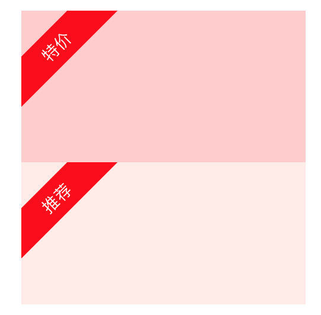

# 一个角标控件

在任意 UIView 左上角打上一个文字标记，比如“特价”、“推荐”、“vip”等：

## 用法

将 CornerStamp.h/m、UIView+CornerStamp.h/m 四个文件拖到项目中。
你可以创建一个 CornerStamp 实例并将它添加到任意 UIView 的 subviews 中，也可以使用 UIView+CornerStamp 分类中的 addStamp 方法。具体请参考 demo 中的 ViewController.m 文件。
